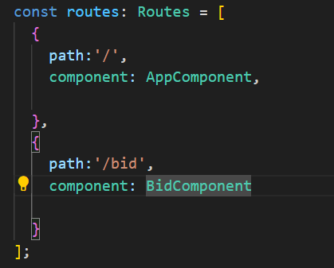
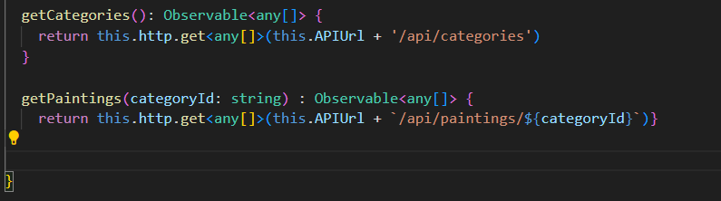
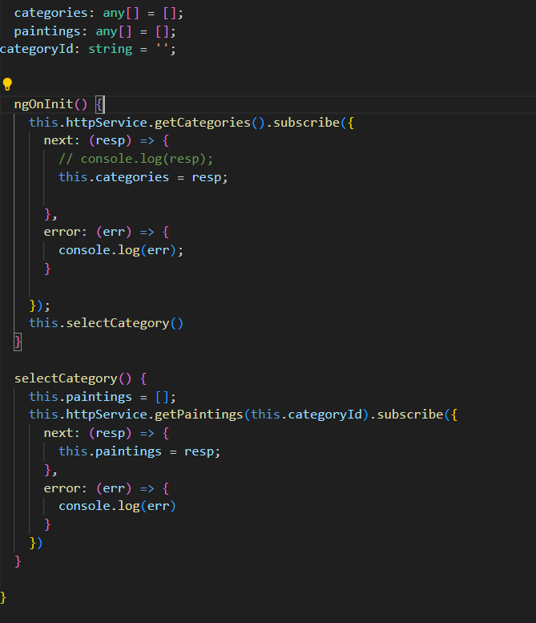
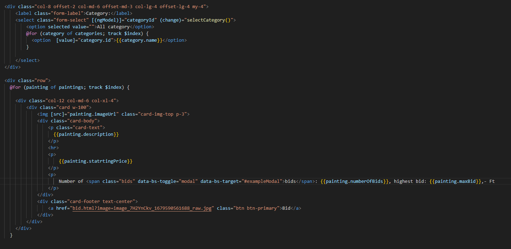

Bootrap hasznalata :angular.json fileba "styles": [
"src/styles.css",
"node_modules/bootstrap/dist/css/bootstrap.min.css"
],
"scripts": [
"node_modules/bootstrap/dist/js/bootstrap.bundle.min.js"
]

app routing-ban kell megadni az utvonalakat

appcomponent.htmlben router outlet hasznalata

app moudel.tsbe importok koze beirni :   HttpClientModule,
    FormsModule

    ng g s http 
    httpService fajlba brini

a. Az oldal tetején lévő – a kategóriákat tartalmazó – lenyíló lista lehetőségeinek
feltöltéséhez használja a /api/categories URL-en található REST API
függvényt!
b. A kiválasztott kategóriához tartozó festmények adatait a kiszolgáló szerver
/api/paintings/{categoryId} URL-jén található REST API
függvénnyel kérdezze le! (Az URL-ben szereplő { categoryId } helyére a
kiválasztott kategória azonosítóját illessze be!)
c. Az adatokat a kiadott mintához hasonlóan jelenítse meg. A megjelenítés során
használhatja a források könyvtárban található állományokat.
httpservice.ts

homecomponent.ts

homecomponent.html

Hozzon létre egy újabb komponenst, amely a licitálást fogja elvégezni:
a. A komponens létrehozása során használhatja a források könyvtárban
szereplő állományokat.
b. A „Send offer” gombra kattintva az űrlapon szereplő adatokat küldje el a
szerver /api/bid URL-re az API leírás alapján!
c. Sikeres küldés esetén jelenítse meg az alábbi feliratot

